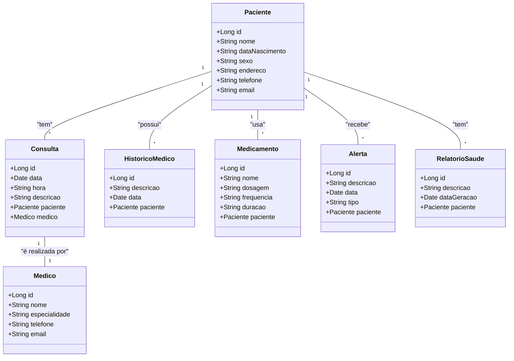

# Sistema de Monitoramento de Saúde
Java RESTful API criada para a ultima atividade DIO.
Sistema de Monitoramento de Saúde - Backend com java

## Principais Tecnologias
**Java 17** | **Spring Boot 3** | **Spring Data JPA** | **OpenAPI (Swagger)** | **Railway**

## Diagrama de Classes (Domínio da API)

